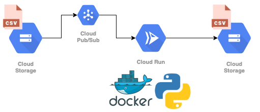
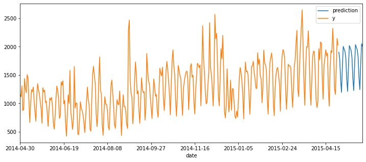

# Serverless & containerized tasks using Google Cloud Run, Pub/Sub, Cloud Storage and Terraform

<p align="center">
  
</p>

## Overview

(A more detailed version is available on my [blog](https://blog.telsemeyer.com/2021/04/24/building-a-serverless-containerized-batch-prediction-model-using-google-cloud-run-pub-sub-cloud-storage-and-terraform/).)

We will build a serverless service which will listen to new files in a Cloud Storage bucket via Pub/Sub, run some small containzerized process via Cloud Run once files are available and publish results of the process to another bucket.

As a process here we will run a simple time series forecasting model (facebook's [prophet](https://facebook.github.io/prophet/)). Alternatively you could also run batch-predictions using a trained model artifact or an external model service, for example to to classify images or videos, or run a simple script to generate some plots.

- [Google Cloud Run](https://cloud.google.com/run) is a service to run containers on a serverless infrastructure.
- [Google Pub/Sub](https://cloud.google.com/pubsub/architecture) is a asynchronous messaging service which allows decoupling of sender and receiver of messages.
- [Google Cloud Storage](https://cloud.google.com/storage) is a service to store objects.
- [terraform](https://www.terraform.io/) is a infrastructure-as-code software.
- [facebook prophet](https://facebook.github.io/prophet/) is a time series forecasting package.

## Prerequisites

Google authentication to enable planning and applying with terraform and updating the image:

```
gcloud auth application-default login
```

You can check if you are authenticated with the right user using `gcloud auth list`.

We run `Terraform v0.14.0`.

## Setup

Run terraform plan & apply using the setup script `setup.sh` which contains the following steps:

```
# build container once to enable caching
(cd app && 
	docker build -t cloud-runner .)

(cd terraform && 
	terraform init && 
	terraform apply)
```

## Test

Since our prototype contains a very simple implementation of facebook's prophet package, let's run a time series forecast on a small dataset, the [hyndsight dataset](https://rdrr.io/cran/fpp2/man/hyndsight.html). 
It contains the daily pageviews of [Rob J. Hyndman's blog](https://robjhyndman.com/hyndsight/)
from 2014-04-30 to 2015-04-29. Rob J. Hyndman is the author of many popular R forecast packages (including [forecast](https://github.com/robjhyndman/forecast)), author of numerous books and research papers and a forecasting expert. The time series in the dataset shows a prominent weekly pattern and upward trend, which we will see below.

We can upload the dataset to GCS with `gsutil`:

```
gsutil cp app/data/hyndsight.csv gs://my-cloud-runner-input-bucket/hyndsight.csv
```

If our infrastructure works properly we should see the results in the output bucket within a few seconds. We can check the Cloud Run logs in the Google console in the meantime. We should see that the container received some data and stores some output file.

```
INFO:root:Data received: ...
...
INFO:root:Output file: gs://my-cloud-runner-output-bucket/hyndsight.csv
```

We can then fetch the output file:

```
gsutil cp gs://my-cloud-runner-output-bucket/hyndsight.csv app/data/hyndsight_forecast.csv 
```

Read both datasets and plot them:

```
import pandas as pd

actual = pd.read_csv("app/data/hyndsight.csv")
forecast = pd.read_csv("app/data/hyndsight_forecast.csv")

data = pd.concat([actual, forecast])

data.plot(x="date", figsize=(12,5))
```



## Deploy new image

Run the simple deploy script `deploy.sh` which contains the following steps:

```
# get project id, image output and service name from terraform output
PROJECT_ID=$(cd terraform && terraform output -json | jq -r .project_id.value)
IMAGE_URI=$(cd terraform && terraform output -json | jq -r .image_uri.value)
SERVICE_NAME=$(cd terraform && terraform output -json | jq -r .service_name.value)

# build and push image
(cd app && 
	./build.sh && 
	IMAGE_URI=$IMAGE_URI ./push.sh)

# update image
gcloud --project $PROJECT_ID \
	run services update $SERVICE_NAME \
	--image $IMAGE_URI \
	--platform managed \
	--region europe-west3

# send traffic to latest
gcloud --project $PROJECT_ID \
	run services update-traffic $SERVICE_NAME \
	--platform managed \
	--region europe-west3 \
	--to-latest

```

## Destroy

Run the destroy script `_destroy.sh` to delete(!) the bucket contents and the project or execute the following steps:

```
# # delete bucket content
# gsutil rm "gs://my-cloud-runner-input-bucket/**"
# gsutil rm "gs://my-cloud-runner-output-bucket/**"
# 
# # destroy infra
# (cd terraform && 
# 	terraform state rm "google_project_iam_member.project_owner" &&
# 	terraform destroy)
```

## Remarks

- Cloud Run run has a [maximum timeout](https://cloud.google.com/run/docs/configuring/request-timeout) of 15 minutes, Google Pub/Sub has a [maximum acknowledge time](https://github.com/googleapis/google-cloud-go/issues/608) of 10 minutes, making it useless for more time-consuming tasks. You can use [bigger resources](https://cloud.google.com/run/docs/configuring/cpu#yaml) though to speed up the processing time.
- Instead of uploading the data to the buckets directly we could upload some kind of manifest containing the path to the data and some ids to maker integration into other system easier.
- The IAM setup of this project is very naive and should be revisited.
- Make sure to always use two different buckets for input and output, otherwise there will be a continious loop when output files are stored in the input bucket.
- The most simple levers to tune and scale the system are container resources and concurrency.
